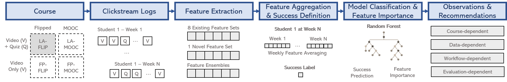

## Can Feature Predictive Power Generalize? Benchmarking Early Predictors of Student Success across Flipped and Online Courses

This repository is the official implementation of the EDM 2021 paper entitled "[Can Feature Predictive Power Generalize? Benchmarking Early Predictors of Student Success across Flipped and Online Courses](https://youtu.be/_1sdX3W5Q5A)".



Early predictors of student success are becoming a key tool in flipped and online courses to ensure that no student is left behind along course activities.  However, with an increased interest in this area, it has become hard to keep track of what the state of the art in early success prediction is.  Moreover, prior work on early success prediction based on clickstreams has mostly focused on implementing features and models for a specific online course (e.g.,  a MOOC). It remains therefore under-explored how different features and models enable early predictions, based on the domain, structure, and educational setting of a given course.  In this paper, we report the results of a systematic analysis of early success predictors for both flipped and online courses.  In the first part, we focus on a specific flipped course. Specifically, we investigate eight feature sets, presented at top-level educational venues over the last few years, and a novel feature set proposed in this paper and tailored to this setting.  We benchmark the performance of these feature sets using a RF classifier, and we provide and discuss an ensemble feature set optimized for the target flipped course.  In the second part, we extend our analysis to courses with different educational settings (i.e.,MOOCs),  domains,  and  structure.   Our  results  show  that(i) the ensemble of optimal features varies depending on the course setting and structure, and (ii) the predictive performance of the optimal ensemble feature set depends on the course activities.

## Requirements

The code has been tested under Python >= 3.6.

1. Create a virtual environment
- Instal virtualenv
```
pip install virtualenv
```
- Create your own
```
pyenv virtualenv hca-env
pyenv activate hca-env
```

- If you are planning on using Jupyter Notebook, add the kernel to the existing kernels.
```
python -m ipykernel install --user --name=hca-env
```

2. Install dependencies:

```setup
git clone https://github.com/d-vet-ml4ed/flipped-classroom.git
cd flipped-classroom
pip install -r requirements.txt
```

We recommend set ```PYTHONPATH``` before running the code:
```
export PYTHONPATH=${PYTHONPATH}:`pwd`
```

## Data Preparation

By default, course grades, problem events, video events, and course schedules are expected to be stored in ```data/course/{flipped-classroom|mooc}/{courseplatform}```.

```
mkdir -p data/course/{flipped-classroom|mooc}/{courseplatform}/grade
mkdir -p data/course/{flipped-classroom|mooc}/{courseplatform}/problem_event
mkdir -p data/course/{flipped-classroom|mooc}/{courseplatform}/video_event
mkdir -p data/course/{flipped-classroom|mooc}/{courseplatform}/schedule
```

In the folder ```data/course/{flipped-classroom|mooc}/{courseplatform}```, a file ```metadata.csv``` [format: course_id, title, teachers, period, start_date, end_date, weeks, grade_thr, grade_max] needs to include course descriptive attributes.

For each course, we expect that the following data is provided in the corresponding subfolders below:
- ```grade/{course_id}.csv``` [format: user_id, grade, date].
- ```problem_event/{course_id}.csv``` [format: user_id, problem_id, event_type, timestamp, problem_type, grade, submission_number].
- ```video_event/{course_id}.csv``` [format: user_id, video_id, event_type, timestamp, seek_type, old_time, current_time, new_time, old_speed, new_speed].
- ```schedule/{course_id}.csv``` [format: id, type, chapter, subchapter, date, duration, grade_max].

## Feature Extraction

To extract a set of features for a course, run this command:

```train
python routine/compute_feature_set.py
    --model "extractor.set.marras_et_al.MarrasEtAl"
    --courses "{flipped-classroom|mooc}/{course_id}"
    --timeframe "{lq-week|eq-week}"
    --workdir "../data/result/edm21/feature/"
```

By default, features are expected to be stored in ```./data/result/edm21/feature/```.

Each course feature set is saved in a folder named as:

```
{lq-week|eq-week}-{feature_set}-{course_id}
```

For each feature set, in the above folder, the following files are stored:
- ```feature_labels.csv``` [format: user_index, label-grade, label-pass-fail, label-dropout, label-stopout]
- ```feature_values.npz``` [shape: (no_users, no_weeks, no_features)]
- ```settings.txt```

## Training and Evaluation

To train and evaluate a predictor on a set of features, run this command:

```train
python routine/train_predictor.py
    --predictor "predictor.random_forest.RandomForest"
    --target_col "label-pass-fail"
    --feature_set "{lq-week|eq-week}-{feature_set}-{course_id}"
    --workdir "../data/result/edm21/"
    --folds 10
```

By default, models and evaluations are expected to be stored in ```./data/result/edm21/```.

Each predictor is saved in a folder named as:

```
{lq-week|eq-week}-{course_id}-{target_col}-{model}-{feature_set}-{aggregation_type}
```

For each predictor, in the above folder, the following files are stored:
- ```params.txt```
- ```predictor-w{week_id}-f{fold_id}.h5``` files
- ```stats.csv``` [format: week, fold, y_train_idx, y_test_idx, auc, bal_acc, f1, acc_fail, acc_pass, bthr, ypred_proba, ypred, ytrue]

## Contributing

This code is provided for educational purposes and aims to facilitate reproduction of our results, and further research
in this direction. We have done our best to document, refactor, and test the code before publication.

If you find any bugs or would like to contribute new models, training protocols, etc, please let us know.

Please feel free to file issues and pull requests on the repo and we will address them as we can.

## Citations
If you find this code useful in your work, please cite our paper:

```
Marras, M., Vignoud, J., Käser, T. (2021).
Can Feature Predictive Power Generalize? Benchmarking Early Predictors of Student Success across Flipped and Online Courses.
In: Proceedings of the 14th International Conference on Educational Data Mining (EDM 2021).
```

## License
This code is free software: you can redistribute it and/or modify it under the terms of the GNU General Public License as published by the Free Software Foundation, either version 3 of the License, or (at your option) any later version.

This software is distributed in the hope that it will be useful, but without any warranty; without even the implied warranty of merchantability or fitness for a particular purpose. See the GNU General Public License for details.

You should have received a copy of the GNU General Public License along with this source code. If not, go the following link: http://www.gnu.org/licenses/.
